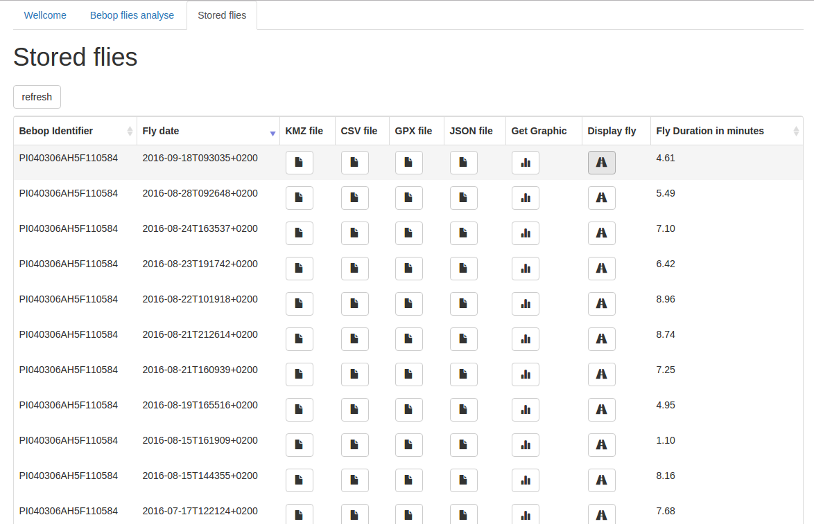
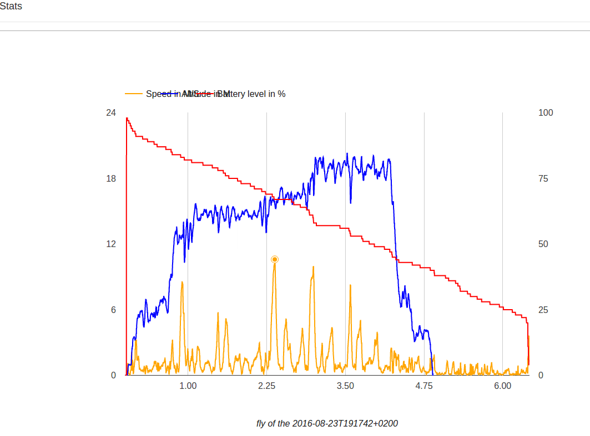
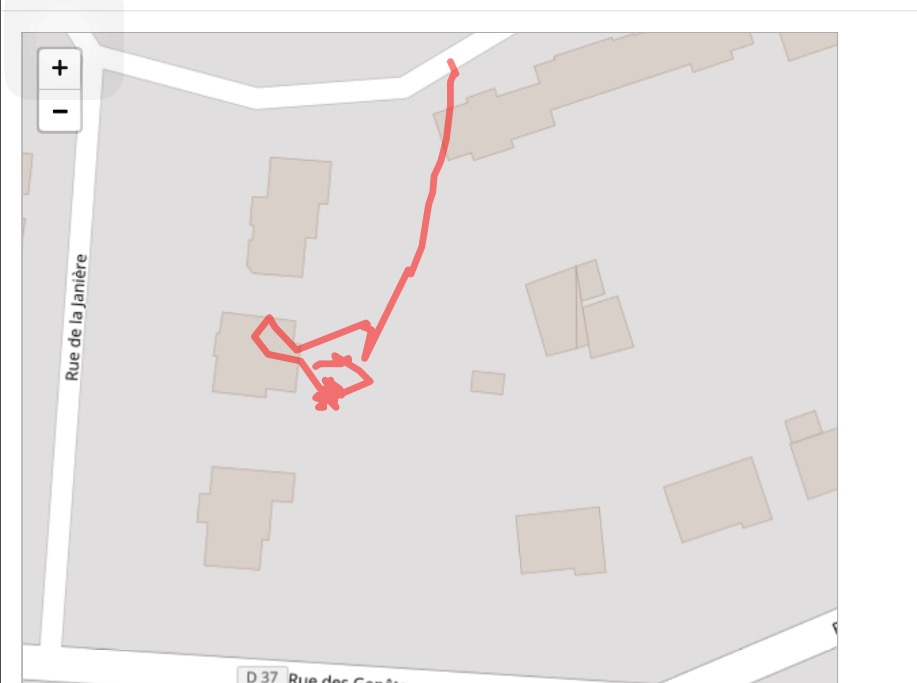

# bebopanalyzer
initial import

Bebop Parrot json flies data analyzer server written in GO. 
This server is very light and can turn on a Raspberry pi.
To start, execute (on unix systems), "bebopanalyzer-1.4.0 conf.json".
Your server now listens on port 8099.
Open your web browser and type the url http://localhost:8099 and enjoy.

Some features, you can get additional files of your files :
Flies 

 - kmz file you can display each flies into Google Maps  or Google Earth https://www.google.com/earth/
 - csv file, gathering all informations of your flies (coordinates, battery state, etc ...)
 - gpx file, fly coordinates compatible with some applications like virbe application from Garmin http://www8.garmin.com/support/download_details.jsp?id=6591
 - json file, original file containing PUD informations
 - Charts of your flies (batterie level, speed and altitude)  
 - fly map display (displaying your way fly) 

